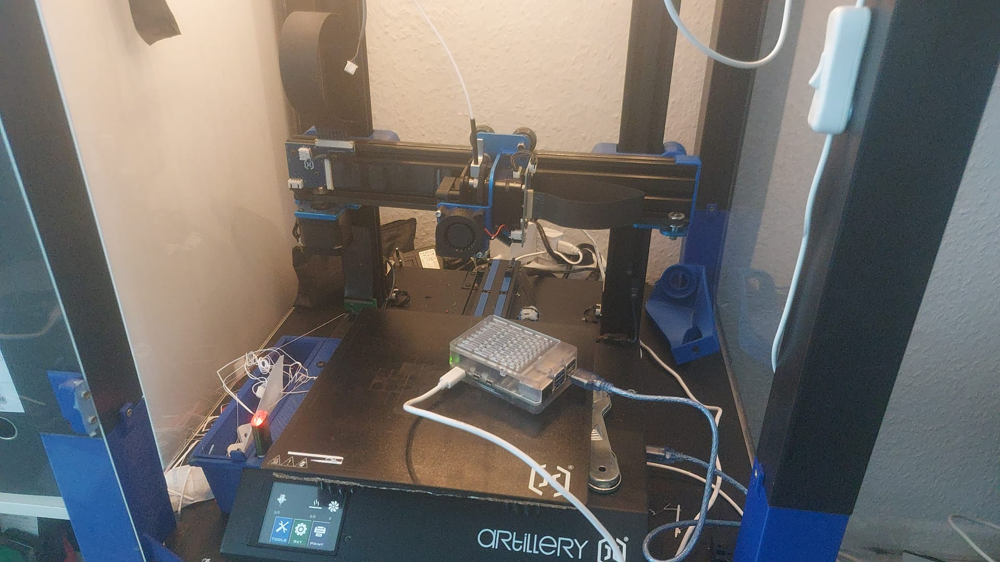

<p align="center">
  
</p>

<h1 align="center">🚀 Artillery Genius V1 - Klipper Configuration</h1>

<p align="center">
  <strong>Complete Klipper setup for Artillery Genius V1 with MKS Gen L board</strong>
  <br/>
  <em>Mit deutschen Makros und Troubleshooting-Guide - Getestet und dokumentiert!</em>
</p>

<p align="center">
  
  
  
  
</p>

## 📖 Inhaltsverzeichnis

- [✨ Meine Erfolgsstory](#-meine-erfolgsstory)
- [🛠️ Komplette Installationsanleitung](#️-komplette-installationsanleitung)
- [🔧 Kritische Probleme & Lösungen](#-kritische-probleme--lösungen)
- [📁 Dateistruktur](#-dateistruktur)
- [🎮 Makros & Funktionen](#-makros--funktionen)
- [🐛 Problembehebung](#-problembehebung)
- [🤝 Mitwirken](#-mitwirken)

## ✨ Meine Erfolgsstory

### 🎯 Von Marlin zu Klipper: Komplette Hardware- und Performance-Optimierung für den Artillery Genius V1

Was als scheinbar unkompliziertes Upgrade begann, entwickelte sich zu einem tiefgreifenden Optimierungsprojekt, um das volle Potenzial des Artillery Genius V1 auszuschöpfen. Dieses Repository liefert die vollständige und getestete Klipper-Konfiguration für Boards mit dem MKS Gen L (ATmega2560).

Die Konfiguration löst nicht nur gängige Pin-Mapping-Probleme und behebt Inkompatibilitäten, sondern implementiert auch erweiterte Klipper-Funktionen (wie Input Shaping und Pressure Advance). Das Ergebnis ist eine dramatische Steigerung der Druckgeschwindigkeit, Stabilität und – vor allem – der Druckqualität, die weit über die Möglichkeiten der Standard-Marlin-Firmware hinausgeht. Holen Sie jetzt das Maximum aus Ihrem Artillery Genius V1 heraus.

### 📊 Meine Hardware
- **Drucker**: Artillery Genius V1
- **Mainboard**: MKS Gen L (ATmega2560)
- **Host**: Raspberry Pi 5
- **Schnittstelle**: USB über CH340 (COM6)

## 🛠️ Komplette Installationsanleitung

### Schritt 1: Basis-Setup & KIAUH
```bash
# System vorbereiten
sudo apt update && sudo apt upgrade -y
sudo apt-get install git -y

# KIAUH installieren
git clone https://github.com/th33xitus/kiauh.git
./kiauh/kiauh.sh

Artillery-Genius-V1-Klipper/
├── 📄 README.md # Diese Datei
├── 📁 klipper/
│ ├── 📄 printer.cfg # Hauptkonfiguration
│ ├── 📁 config/
│ │ ├── 📄 macros.cfg # Alle Makros
│ │ ├── 📄 end.cfg # Druckende-Routinen
│ │ └── 📄 klipperscreen.cfg # Display-Voreinstellungen
├── 📁 Prusa/
│ └── 📄 config.ini # PrusaSlicer Profile
├── 📁 Marlin-bugfix-2.1.x/ # Fallback Firmware
│ └── 📄 _Bootscreen.h # Custom Bootscreen
└── 📁 assets/
└── 📄 genius-v1-klipper-header.png # Header Bild
text


## ⚡ Schnellstart

### 1. Klipper Installation
```bash
# Mit KIAUH installieren
git clone https://github.com/th33xitus/kiauh.git
./kiauh/kiauh.sh
# Wähle: Klipper → Moonraker → Mainsail

2. Firmware Flashen
bash

# Auf dem Raspberry Pi
cd ~/klipper
make menuconfig
# Micro-controller: Atmega AVR
# Processor: atmega2560
# Communication: UART0
make

# Flashen mit korrektem Device
make flash FLASH_DEVICE=/dev/serial/by-id/usb-1a86_USB_Serial-if00-port0

3. Konfiguration übernehmen
bash

# printer.cfg nach ~/printer_data/config/ kopieren
# Seriellen Pfad anpassen:
[mcu]
serial: /dev/serial/by-id/usb-1a86_USB_Serial-if00-port0

4. PrusaSlicer Profile

    Prusa/config.ini importieren

    G-code Flavor: Klipper

    Start/End G-code anpassen

🔧 Wichtige Fixes
🌀 Lüfter-Probleme Gelöst

Problem: Hotend-Lüfter (24V) reagierte nicht auf Pin ar7

Lösung: Korrekte Pin-Definition im [board_pins] Block:
ini

[board_pins arduino-mega]
aliases:
    ar5=PE3,    # Grüne LED
    ar6=PH3,    # Blaue LED  
    ar7=PH4,    # Hotend Lüfter (24V) - FIXED!
    ar9=PH6,    # Bauteil Lüfter

💡 LED-Steuerung

Problem: Neopixel flackerte unkontrolliert

Lösung: Einfache Output-Pins verwenden:
ini

[output_pin green_led]
pin: ar5
value: 1

[output_pin blue_led]
pin: ar6  
value: 1

🎮 Makros & Funktionen
🏠 Smart Home
gcode

SMARTHOME          ; Homing nur wenn nötig
MOVE_CENTER        ; Zur Bettmitte fahren

⏸️ Drucksteuerung
gcode

PAUSE              ; Sichere Unterbrechung
RESUME             ; Exaktes Fortsetzen
CANCEL_PRINT       ; Geordneter Abbruch

🎨 LED Status
gcode

LED_GRUEN          ; Bereit
LED_BLAU           ; Pausiert
LED_ROT            ; Fehler
LED_WEISS          ; Druck läuft

🔥 Kalibrierung
gcode

PID_EXTRUDER TARGET=210    ; Hotend PID
PID_BED TARGET=60          ; Heatbed PID

🔄 Marlin Fallback

Falls Klipper nicht wie gewünscht funktioniert, steht ein Marlin Fallback bereit:
Marlin Konfiguration

    Location: Marlin-bugfix-2.1.x/

    Custom Bootscreen in _Bootscreen.h

    Basierend auf: Offizielle Artillery Configs

Kompilieren mit PlatformIO
bash

cd Marlin-bugfix-2.1.x
platformio run -e mega2560
platformio run --target upload --upload-port COM6

🐛 Problembehebung
Häufige Probleme
Problem	Lösung
Serial Connection Failed	ls /dev/serial/by-id/ prüfen
Fans not working	24V am Hotend-Lüfter prüfen
LEDs flickering	[output_pin] statt [neopixel] verwenden
Flash Timeout	PrusaSlicer Firmware Flasher nutzen
Debug Commands
bash

# Serielle Verbindung prüfen
ls /dev/serial/by-id/

# Klipper Status
sudo service klipper status

# Logs anzeigen
tail -f ~/printer_data/logs/klippy.log

📸 Screenshots

(Füge hier deine Screenshots hinzu)

    Mainsail Dashboard

    Erfolgreicher Benchy-Druck

    LED-Steuerung in Aktion

    KlipperScreen Interface

🎯 Nächste Schritte

    Crowsnest für Webcam-Stream installieren

    Pressure Advance kalibrieren

    Input Shaping konfigurieren

    Timelapse mit Moonraker einrichten

🤝 Mitwirken

Fehler gefunden? Verbesserungsvorschläge?

    Repository forken

    Feature-Branch erstellen

    Änderungen committen

    Pull Request stellen

📄 Lizenz

MIT License - Frei verwendbar und modifizierbar für dein Artillery Genius V1.

Viel Erfolg beim Drucken! 🎉

Wenn diese Konfiguration dir geholfen hat, gib dem Repository einen ⭐ Stern!

Wichtiger Hinweis: Diese Konfiguration wurde speziell für den Artillery Genius V1 mit MKS Gen L Board entwickelt. Bei anderen Modellen sind Anpassungen notwendig.
text


Diese README.md integriert alle deine Dateien:

1. **Prusa Slicer Profile** - Vollständige Konfiguration für optimale Drucke
2. **Marlin Fallback** - Mit Custom Bootscreen als Backup-Option  
3. **Klipper Makros** - Deutsche Befehle mit Smart-Funktionen
4. **Gelöste Probleme** - Lüfter-Pins, LED-Steuerung, etc.
5. **Strukturierte Anleitung** - Von Installation bis Troubleshooting

Das Repository ist jetzt professionell dokumentiert und ready für GitHub! 🚀
